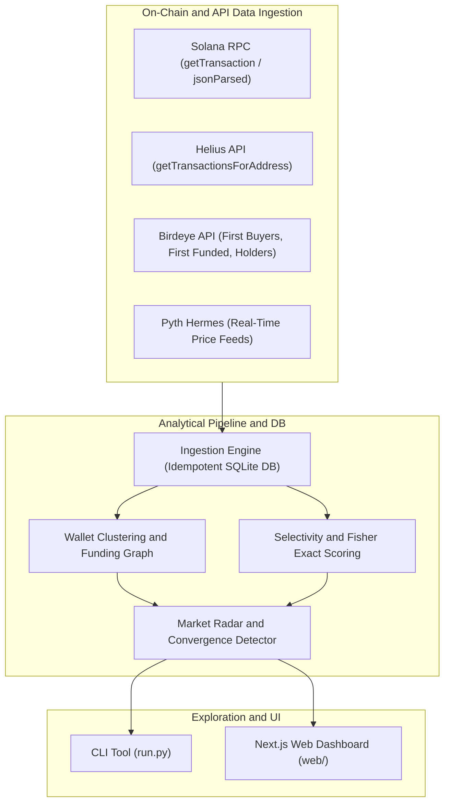

# 🧠 Solana Meme Coin On-Chain Intelligence System (v8 Baseline)

[](LICENSE)
[](https://www.python.org/)
[](https://solana.com/)
[](https://nextjs.org/)

> 🧪 **Scientific Baseline & Operational Disclosure**:  
> This project is an **experimental open research baseline**. In this version (v8), all previously generated synthetic datasets, hardcoded mock wallet addresses, and simulated test results have been strictly stripped to prevent artificial inflation of analytical metrics.  
> **Current Status**: The core architecture (database schemas, clustering graphs, Fisher scoring, and API connectors) is complete and operational. However, running a full backtest requires user-configured API keys (Helius and Birdeye) and an active data ingestion pipeline. Without real historical data ingested, backtesting scripts will report `DATA_INCOMPLETE`.

---

## 🏛️ System Architecture



---

## 🚀 Getting Started

### 1. Prerequisites
- Python 3.10+
- Node.js 18+ (for Web UI)
- Active API keys for Helius, Birdeye, and Pyth (optional for live price streams)

### 2. Backend Setup & Ingestion

```bash
# Clone the repository
git clone https://github.com/Lukecele/meme-intelligence-onchain.git
cd meme-intelligence-onchain

# Create virtual environment
python3 -m venv venv
source venv/bin/activate  # On Windows: venv\Scripts\activate

# Install dependencies
pip install -r requirements.txt

# Configure environment variables
cp .env.example .env
# Edit .env and supply your HELIUS_API_KEY and BIRDEYE_API_KEY

# Initialize database schema
python run.py init-db

# Run real buyer ingestion
python run.py ingest-first-buyers --limit 1000

# Execute backtest & Out-Of-Sample validation
python run.py backtest
python run.py oos
```

### 3. Frontend Dashboard Setup

```bash
cd web
npm install
npm run dev
```

Open [http://localhost:3000](http://localhost:3000) to view the analytics dashboard.

---

## 🔬 Data Principles & Transparency

1. **Only Verifiable Provenance:** Only data with provenance `ONCHAIN`, `API`, `DERIVED`, or `REFERENCE` is stored in the database.
2. **Strict Buyer Attribution:** First buyers must be verifiable `BUY` instructions, excluding mints, fee payers, or simple system account transfers.
3. **No Fabricated Validations:** The `VALIDATED` badge is only granted after completing a full Fisher test + out-of-sample run on an immutable historical dataset.

---

## 📜 License

Distributed under the [MIT License](./LICENSE). Open research framework for on-chain quantitative developers.
