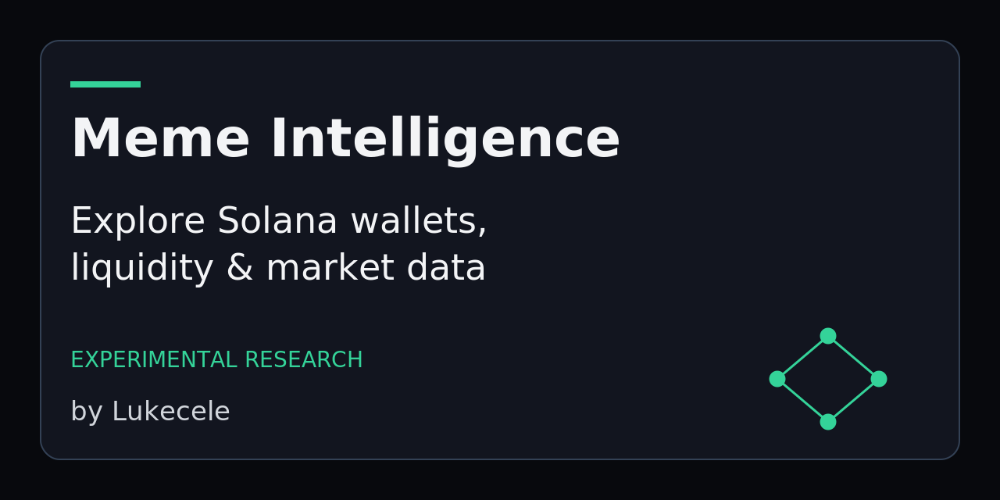
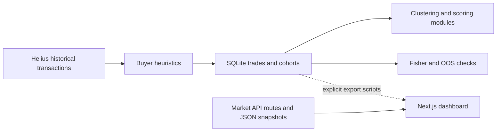

# Meme Intelligence

[](https://github.com/Lukecele/meme-intelligence-onchain/actions/workflows/ci.yml)

**Explore Solana wallets, liquidity & market data.**

An experimental research toolkit by [Luca Celebrano (@Lukecele)](https://github.com/Lukecele), founder and sole member of arbincept. Investigate early buyer cohorts, wallet funding relationships and market context, then examine whether observed patterns survive historical checks.



[Quick start](#quick-start) · [Offline example](#reproducible-offline-example) · [Research limits](#research-status-and-limits) · [MIT license](LICENSE)

## Research status and limits

This repository is an **experimental baseline**, not evidence of trading performance. Python modules implement ingestion, SQLite storage, wallet clustering, scoring and statistical checks; a separate Next.js dashboard explores exports and API data. The CLI exposes initialization, first-buyer ingestion, backtest and out-of-sample (OOS) checks. It does not expose order execution. The dashboard includes an investment simulator; simulated positions are not executed trades.

- Backtests need actually acquired historical transactions and reviewed winner/control cohorts. Empty or insufficient datasets return `DATA_INCOMPLETE`; this is a missing-data result, not a successful backtest.
- The first-buyer parser uses balance changes and fee-payer heuristics. Its `BUY` labels require review: they do not prove that every transaction is a swap or that historical coverage is complete.
- Trade provenance fields distinguish `ONCHAIN`, `API`, `DERIVED`, `REFERENCE` and `SIMULATED`. The schema permits simulation, while the backtest and OOS queries select only `ONCHAIN`/`API` first-buy rows. Labels alone do not establish provenance.
- The Fisher check derives its candidate cohort from winner observations. It is exploratory, not independent proof of predictive power. OOS defaults train on BONK/WIF and evaluate POPCAT/MEW; freeze and audit datasets before interpretation. An OOS `PASSED` result alone does not demonstrate profitability or complete historical coverage.
- Committed JSON exports and dashboard values are snapshots, not independently verified results or a live performance record. No complete ingestion or profitable strategy is claimed here.

## Data path


```mermaid
flowchart LR
    A[Helius historical transactions] --> B[Buyer heuristics]
    B --> C[SQLite trades and cohorts]
    C --> D[Clustering and scoring modules]
    C --> E[Fisher and OOS checks]
    C -. explicit export scripts .-> F[Next.js dashboard]
    G[Market API routes and JSON snapshots] --> F
```

The CLI database is not automatically synchronized with every dashboard view. See [schema](db/schema.sql), [CLI](cli/main.py), [extractors](extractors/), [analytics](analytics/) and [web application](web/).

## Quick start

Use Python 3.10+ (CI uses 3.12). For the optional dashboard, use a Node.js version compatible with Next.js 14 (minimum 18.17) and npm.

```bash
git clone https://github.com/Lukecele/meme-intelligence-onchain.git
cd meme-intelligence-onchain
python3 -m venv .venv
source .venv/bin/activate
# Windows: .venv\Scripts\activate
python -m pip install -r requirements.txt
python run.py --help
python run.py init-db
python run.py backtest
python run.py oos
```

Initialization creates `data/onchain_intelligence.db` without synthetic seeds. On a new empty database, both checks return `DATA_INCOMPLETE`. Existing local data affects their results; initialization does not clear it. `requirements.txt` declares dependencies and `requirements.lock` provides a separate pinned snapshot.

### Reproducible offline example

After installing dependencies, run this from the repository root. It uses a temporary empty database, makes no provider requests and leaves your research database intact.

```bash
python - <<'PY'
from pathlib import Path
from tempfile import TemporaryDirectory
from db.database import Database
from analytics.backtest_validator import BacktestValidator
from analytics.out_of_sample_tester import OutOfSampleValidator

with TemporaryDirectory() as directory:
    path = Path(directory) / "research.db"
    result = BacktestValidator(Database(path)).run_full_validation()
    oos = OutOfSampleValidator(path).run_blind_test()
    print("Backtest:", result["decision"])
    print("Verified first-buy rows:", result["metrics"]["verified_first_buy_rows"])
    print("OOS:", oos["status"])
PY
```

Expected output (an empty-data diagnostic, not a simulated market analysis):

```text
Backtest: DATA_INCOMPLETE
Verified first-buy rows: 0
OOS: DATA_INCOMPLETE
```

### API configuration and historical ingestion

Copy `.env.example` to `.env` and fill only the keys needed for your workflow. Keep secrets local. The Python settings loader reads this root file and overrides matching environment variables.

| Setting | Used for |
| --- | --- |
| `HELIUS_API_KEY` | Required by CLI first-buyer ingestion through Helius `getTransactionsForAddress`; your account must support that method and historical access. |
| `BIRDEYE_API_KEY` | Separate Birdeye connectors for token, holder and buyer research; not required by the CLI's Helius ingestion path. |
| `SOLANA_RPC_URL` | General RPC connector endpoint; does not replace Helius authentication for historical ingestion. |
| `PYTH_API_KEY` | Required when using the implemented authenticated Pyth price client; unused by offline checks. |
| `TELEGRAM_BOT_TOKEN`, `TELEGRAM_CHAT_ID` | Optional alert delivery; unnecessary for the quick start. |

```bash
cp .env.example .env
# Edit .env locally, then review config/tokens.py before ingestion.
python run.py ingest-first-buyers --limit 1000
python run.py backtest
python run.py oos
```

The limit applies per token; the extractor also caps pagination. API access, rate limits, coverage and parser quality can leave the dataset incomplete. Review transaction references, cohort selection and launch times; acquire sufficient real history and freeze a reproducible dataset before interpreting results. Ingestion alone does not guarantee a valid experiment.

### Optional web dashboard

```bash
cd web
npm ci
npm run dev
```

Open [the local dashboard](http://localhost:3000). The UI uses bundled data and server API routes; starting it does not acquire historical data. Root Python `.env` loading does not configure Next.js. Inspect [web API routes](web/src/app/api/) for route-specific credentials and external services before using live views.

## Checks and contribution

Without API keys or historical data, you can initialize a database, run the empty-data example and execute the CI scoring/parser fixtures:

```bash
python -m pip install pytest pytest-asyncio
PYTHONPATH=. pytest tests/test_analytics.py
python -m compileall -q .
```

These checks exercise local behavior, not live API availability. Other scripts named `test_*` may call providers. See [contribution guidance](CONTRIBUTING.md) and [security policy](SECURITY.md).

If this research is useful, [star the repository](https://github.com/Lukecele/meme-intelligence-onchain) or [follow Lukecele](https://github.com/Lukecele). Methodology improvements and reproducible data-quality reports are welcome.

[Technical abstract and sharing assets](docs/presentation.md) · [MIT license](LICENSE)
